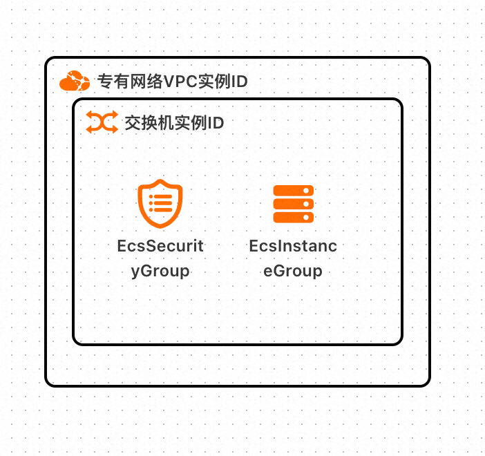
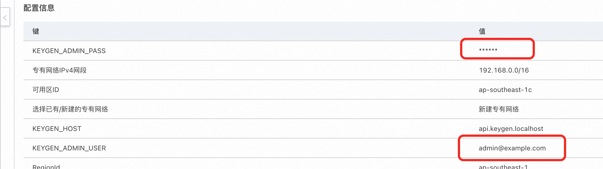

# Keygen计算巢快速部署


>**免责声明：**本服务由第三方提供，我们尽力确保其安全性、准确性和可靠性，但无法保证其完全免于故障、中断、错误或攻击。因此，本公司在此声明：对于本服务的内容、准确性、完整性、可靠性、适用性以及及时性不作任何陈述、保证或承诺，不对您使用本服务所产生的任何直接或间接的损失或损害承担任何责任；对于您通过本服务访问的第三方网站、应用程序、产品和服务，不对其内容、准确性、完整性、可靠性、适用性以及及时性承担任何责任，您应自行承担使用后果产生的风险和责任；对于因您使用本服务而产生的任何损失、损害，包括但不限于直接损失、间接损失、利润损失、商誉损失、数据损失或其他经济损失，不承担任何责任，即使本公司事先已被告知可能存在此类损失或损害的可能性；我们保留不时修改本声明的权利，因此请您在使用本服务前定期检查本声明。如果您对本声明或本服务存在任何问题或疑问，请联系我们。

## 概述
Keygen.sh是一个网站，它提供了一种生成密钥（或者称为序列号、激活码）的工具。这个网站允许用户根据其需要生成不同的密钥，用于授权软件或服务的使用。它可以生成各种类型的密钥，包括软件许可证密钥、游戏激活密钥等。尽管Keygen.sh提供了一种方便的方式来生成密钥，但是需要注意的是，未经授权使用他人软件的密钥是违法的。因此，在使用Keygen.sh或其他类似工具时，务必要遵守版权法律，并只使用由合法渠道获得的授权密钥。

## 前提条件

部署Keygen社区版服务实例，需要对部分阿里云资源进行访问和创建操作。因此您的账号需要包含如下资源的权限。
  **说明**：当您的账号是RAM账号时，才需要添加此权限。

| 权限策略名称                          | 备注                     |
|---------------------------------|------------------------|
| AliyunECSFullAccess             | 管理云服务器服务（ECS）的权限       |
| AliyunVPCFullAccess             | 管理专有网络（VPC）的权限         |
| AliyunROSFullAccess             | 管理资源编排服务（ROS）的权限       |
| AliyunComputeNestUserFullAccess | 管理计算巢服务（ComputeNest）的用户侧权限 |


## 计费说明

Keygen社区版在计算巢部署的费用主要涉及：

- 所选vCPU与内存规格
- 系统盘类型及容量
- 公网带宽

## 部署架构

    
|

## 部署流程
1. 访问计算巢Keygen社区版[部署链接](https://computenest.console.aliyun.com/service/instance/create/cn-hangzhou?type=user&ServiceName=Keygen社区版)，按提示填写部署参数：
    

2. 参数填写完成后可以看到对应询价明细，确认参数后点击**下一步：确认订单**。
   

3. 确认订单完成后同意服务协议并点击**立即创建**
   进入部署阶段。

4. 等待部署完成后就可以开始使用服务，进入服务实例详情点击keygen链接和hosts。
   
   您可以配置hosts访问 或者按域名配置cname到公网ip访问域名

## 高级配置

可以把证书拷贝到caddy中以防止https访问告警
```docker cp keygen-docker-compose-caddy-1:/data/caddy/pki ./certificates```

## 使用服务

本文将提供两种方式测试本服务。两种方式均通过http API访问服务，以下提供了基本的http调用方式的指令。

```api
@host = {{$dotenv KEYGEN_HOST}}
@adminUser = {{$dotenv KEYGEN_ADMIN_USER}}
@adminPass = {{$dotenv KEYGEN_ADMIN_PASS}}

# @name ping
GET https://{{host}}/v1/ping

###

# @name adminlogin
POST https://{{host}}/v1/tokens
Authorization: Basic {{adminUser}}:{{adminPass}}

### Get all tokens

@adminToken = {{adminlogin.response.body.data.attributes.token}}
POST https://{{host}}/v1/tokens
Authorization: Bearer {{adminToken}}

### Create a user
POST https://{{host}}/v1/users
Authorization: Bearer {{adminToken}}
Content-Type: application/vnd.api+json
Accept: application/vnd.api+json

{
    "data": {
          "type": "users",
          "attributes": {
            "firstName": "John",
            "lastName": "Doe",
            "email": "jdoe@keygen.sh",
            "password": "secret"
          }
    }
}

### Get all users
GET https://{{host}}/v1/users
Authorization: Bearer {{adminToken}}
```
更多使用方法请参考[文档](https://keygen.sh/docs/getting-started/)

### 配置Hosts（必须）


当应用部署完成，会展示host地址：


将此地址配置到hosts（注windows和macOS不同），如下图为MacOs，在终端中输入
````
sudo vim /etc/hosts
````


将host地址粘贴到此处，保存退出。


以下将展示两种方式调用如下命令
````
GET https://{{host}}/v1/ping
````

### Curl方式
在终端中，输入
````
GET -k https://api.keygen.localhost/v1/ping -v
````
返回值如下，代表连接成功。注意，由于ping正常没有返回值，因为输入-v展示详细内容，并输入-k忽略ssl证书认证。

其余命令调用方式同上。

### VS方式
下载Vs Code，安装插件Rest Client

进入[链接](https://github.com/aliyun-computenest/quickstart-keygen), 将代码下载到本地，将文件.env.example重命名为.env。
打开api.rest，点击 send request。




